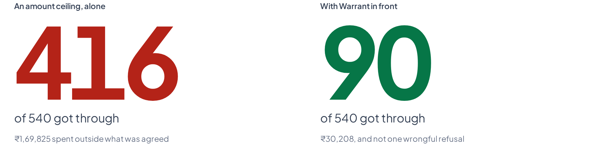
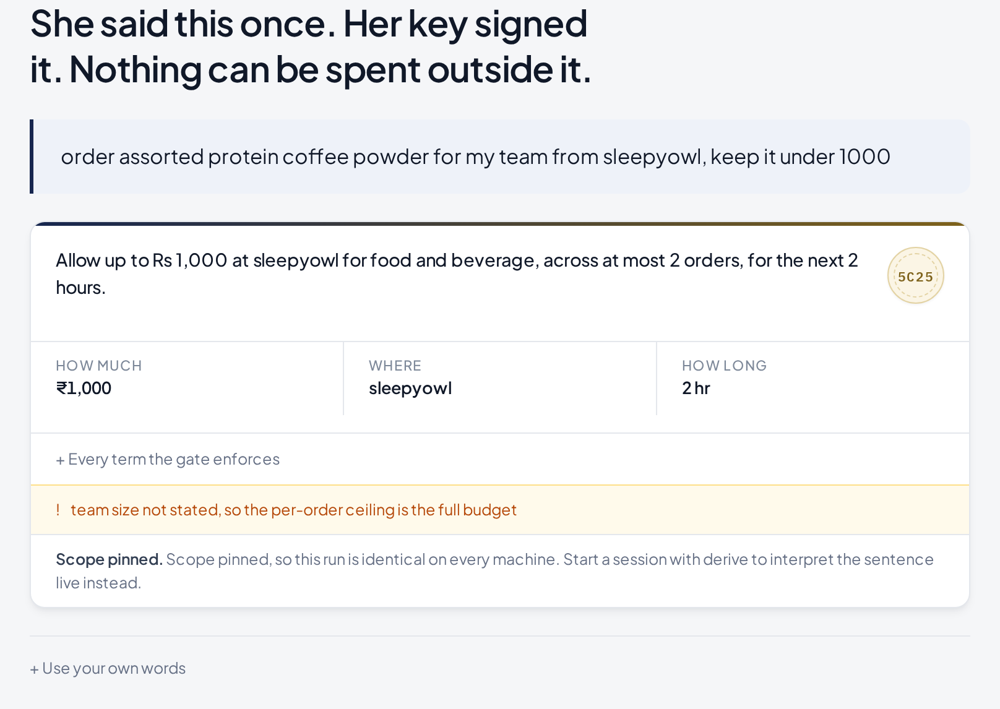

<div align="center">

# Warrant

### No agent spends without one.

**An authorization layer for agent-initiated payments.**
Every rupee an agent spends traces back to a scope a human signed —
checked *before* settlement, provable *after* dispute.

<br>

[](#verifying-it)
[](#verifying-it)
[](#results)
[](#the-real-rail)
[](pyproject.toml)

<br>

*Built for the Razorpay AI Buildathon · Track 01, AI Growth & Agentic Commerce*

[The deck](docs/deck.html) · [Architecture](ARCHITECTURE.md) · [Integrating it](docs/INTEGRATION.md)

</div>

---

## Track 01 · the bar, line by line

> *Every money action explainable, bounded and gated. Show the audit trail and
> one failure handled gracefully.*

| The bar | Where it is |
| :--- | :--- |
| **Explainable** | Every verdict names the rule that produced it and the observed-versus-limit numbers behind it — `merchant.mcc_scope`, `scope.category`, `replay.cart_nonce`. Nothing says "declined". |
| **Bounded** | A hard `Envelope` no derived scope may exceed, and inside it a scope the person signed with their own device key. The narrower of the two always wins. |
| **Gated** | `gate.evaluate()` is the only thing that can block, and it is a pure function of the signed documents and the state. [No model can change a verdict](#where-the-model-runs--and-where-it-deliberately-doesnt). |
| **Audit trail** | A hash-chained ledger where **refusals are entries, not silences**. Edit any entry and every entry after it orphans — the console has a button that lets you try. |
| **One failure handled gracefully** | The agent proposes two units of a real ₹349 coffee — ₹698 — and Warrant refuses to decide it: that crosses the ₹500 the person said needs their say-so. The run stops and the console asks *them*. Approving signs the basket with their own key, the same gate runs again, and the check that failed now passes — because a signature exists that did not before. |

*"...or that makes a merchant transactable by an AI buyer end to end"* — that is
this project. An AI buyer arrives with a signed permission, the merchant checks
the basket against it before taking money, and both sides keep a record that
survives a dispute.

## The problem

Since **February 2026**, Razorpay and NPCI have run agentic UPI payments in
production on Claude — with Zomato, Swiggy and Zepto. They use **UPI Reserve Pay**:
the customer blocks funds once, and the agent then debits against that block
repeatedly **with no further PIN**.

That leaves two holes, and both are open today.

> **Nothing checks the debit against the intent before the money moves.**
> The customer said *"coffee for my team, under ₹1,000."* The block is authorized.
> What stops a ₹449 charge for a mug nobody asked for?

> **When the dispute lands, the merchant has no evidence.**
> An agent-initiated payment has no device fingerprint, no browsing session, no
> click. Chargeback reason codes have no category for *correctly authorized agent,
> wrong outcome*. The merchant eats it.

Merchants respond to undefendable losses in exactly one way: they throttle the
traffic that causes them. Low agent limits, category blocks, or refusing agent
checkouts outright. **The bottleneck on agentic commerce is not the payment
rails — it is that nobody can prove what the customer agreed to.**

Warrant closes both holes with one object: **a signed chain from the words a
person said to the rupee that moved.** A merchant with it in front can accept
agent traffic that its competitors have to refuse.

<br>

<div align="center">

<br><em>Over <b>540 labelled cases</b>: an amount ceiling on its own lets 416 through. Warrant lets 90 — and has never once stopped a purchase the person authorised.</em>
</div>

<br>

<div align="center">

<br><em>A live model shops a real merchant's catalogue against a signed permission. Every verdict names the rule that produced it — and when one needs a human, it stops and asks.</em>
</div>

---

## Nothing here is a mock

The single fastest way to dismiss a project like this is to notice the demo was
written by its own author. So it is not.

| | |
| :--- | :--- |
| **The merchant** | [Sleepy Owl Coffee](https://sleepyowl.co), a real Indian brand. 62 products read from the `products.json` feed every Shopify storefront publishes — their titles, their SKUs, their prices, their photographs. No key, no account, no onboarding. |
| **The refusal** | *The Ground Coffee Mug*, ₹449, which they genuinely sell. Nobody planted it: a coffee company sells mugs, and a permission for food and drink refuses one — twice, once by the category code an acquirer assigns a coffee brand and once by the permission itself. |
| **The agent** | A live model choosing from that catalogue. It is never told the limits, only the reason it was refused. |
| **The payment** | Razorpay's own Checkout, on a real test-mode order this server created. `pay_TXuokhWC59OdV3` is a captured payment, and the signature over it was recomputed here against the key secret before anything on screen said so. `make browser-razorpay` drives that whole path and asserts the captured id. |
| **The record** | A hash-chained ledger you can break from the UI and watch orphan. |

Two things *are* ours, and both say so on screen: the two product names carrying
injected instructions — no real merchant has planted one yet, and claiming
otherwise would be a lie about a company that exists — and the committed
snapshot of the catalogue, so a clone never depends on somebody else's site
being up. `make catalog-refresh` re-fetches it.

## How it works

```
IntentMandate    signed by the PERSON's device key
    │            "up to ₹1,000 at this merchant, on food, for 2 hours"
    ▼
CartMandate      signed by the AUTHORISER
    │            "I checked this basket against that intent. It fits."
    ▼
DebitReceipt     signed by the AUTHORISER
                 "this rail payment settled that cart under that intent"
```

Each document binds to the one above it by **content address** — `im_a3f2…` *is*
the first 16 hex of the intent's digest, so an id cannot be forged or reassigned.

**Only the person's key can widen what may be spent.** The authoriser can attest
that something already permitted was checked; it cannot grant authority it was
never given.

<details>
<summary><b>Exactly what the chain guarantees, stated precisely</b></summary>

<br>

A compromised authoriser **can** still skip its own gate and call the rail. The
rail enforces the blocked *amount*, not the category allowlist, so it could spend
the remaining block on anything. The chain does not prevent that — it makes it
**provable afterwards**, because the receipt names a cart, the cart names an
intent, and anyone with the subject's public key can see the purchase fell
outside what was signed.

**Detection with attribution.** That is the strongest claim a merchant-side
layer can make honestly, and it is the claim this makes.

Enforcing it outright needs the *rail* to carry scope, not just an amount — which
is precisely the layer NPCI's UAP is being designed to occupy. This is a working
specification of what that layer has to do, running today where it can run.

</details>

---

## Use it in your own product

Warrant is not a demo of a payment flow — it is a layer you put in front of one.
Nothing in it knows about any particular merchant, country or rail.

```python
import time

from warrant import Warrant
from warrant.models import Scope

now = int(time.time())
warrant = Warrant(merchants="warrant.example.toml")

# Once, when the person approves. These bounds normally come from a form.
permission = warrant.permit("lunch for the team", scope=Scope(
    merchants=("acme-grocers",),
    categories=("food_beverage",),
    max_total_paise=100_000,
    max_per_txn_paise=50_000,
    max_txns=3,
    not_before=now,
    expires_at=now + 7200,
))

# Every time the agent proposes a basket.
sandwich = {"sku": "sandwich", "category": "food_beverage", "qty": 2, "unit_paise": 24_000}
cable = {"sku": "cable", "category": "electronics", "qty": 1, "unit_paise": 29_900}

assert warrant.check(permission, "acme-grocers", [sandwich]).allowed
assert not warrant.check(permission, "acme-grocers", [cable]).allowed

# Charge it. Pass an idempotency key to anything that can be retried.
paid = warrant.spend(permission, "acme-grocers", [sandwich], idempotency_key="order-4417")
assert paid.settled

warrant.close()
```

Or mount the service into an app you already have:

```python
import secrets

from fastapi import FastAPI

from warrant import Warrant
from warrant.service import ApiKeyAuth, warrant_router

app = FastAPI()
app.include_router(
    warrant_router(
        Warrant(merchants="warrant.example.toml"),
        auth=ApiKeyAuth([secrets.token_urlsafe(32)]),
    )
)
```

`warrant_router` **refuses to be constructed without authentication**. A service
that mints spending permissions should not become usable-because-reachable
because an argument was forgotten; running open is possible and has to be
spelled `auth=NO_AUTH`.

### Everything is a file you supply

| | | |
|---|---|---|
| Merchants and their ISO 18245 codes | `WARRANT_MERCHANTS` | [`warrant.example.toml`](warrant.example.toml) |
| Products | `WARRANT_CATALOG` | [`catalog.example.toml`](catalog.example.toml) |
| API keys | `WARRANT_API_KEYS` | — |

With nothing configured the console reads the committed snapshot of a real
storefront, which is what you see when you clone this and run it. Point
`WARRANT_CATALOG` at your own file and it sells whatever you sell.

The bundled product list is the last resort, and the deliberate choice of the
scripted demo and the benchmark — those two have to produce identical output on
every machine, so they read it explicitly rather than whatever happens to be
configured.

**[Full integration guide →](docs/INTEGRATION.md)** — three calls, the verdict
table, retries, endpoints, and a production-notes section that says plainly
which defaults are wrong for a deployment.

---

## Results

**540 labelled sessions, four policies, one seed.** `make bench` reproduces this
exactly on any machine.

| policy | violations caught | leaked | legitimate spend blocked |
| :--- | ---: | ---: | ---: |
| `no_gate` — today's default | 0.0% | ₹302,663 | ₹0 |
| `amount_only` — a ceiling and nothing else | 16.0% | ₹169,825 | ₹0 |
| `model_only` — ask a model if the basket looks right | 0.8% | ₹300,667 | ₹160 |
| **`warrant`** | **81.8%** | **₹30,208** | **₹0** |

**Reproducible without paying for anything.** The engine runs on Anthropic or on
Groq's free tier — same interface, and the engine cannot tell which answered. A
submission whose numbers can only be checked by someone holding a paid API key is
a submission whose numbers cannot really be checked. Drop a free
[Groq key](https://console.groq.com/keys) into `.env` and run `make bench-live`
yourself.

Measured, committed and checked on every build: `bench/RESULTS.json` is written by
`make bench`, the table above quotes it, and **`make docs-check` fails the build if
the two disagree.** The numbers in this document cannot drift away from the numbers
the code produces.

**Decision latency** — this sits in the payment path, so it is measured, not
assumed: **p50 under 300µs and p99 under 3ms** across 540 in-process decisions with
no model call. Stated as bounds rather than a point, because a hardware figure
quoted to the microsecond is a claim about my laptop.

### Measured to the edge of what arithmetic can reach

Every number above comes from data this repository generates, reproducibly, from
a clean clone. Most benchmarks stop at the headline. This one maps exactly where
deterministic checking ends and reading begins — which is the reason the advisory
judge exists, and the reason its authority is capped in code.

**`injection_subtle`: 0 of 45. `semantic_drift`: 0 of 45.** Both sit inside every
bound the subject signed — right merchant, right category, under every ceiling — so
no arithmetic touches them, and the payload in `injection_subtle` is phrased to
evade the instruction-text heuristic. Only reading the basket against the
instruction catches either, and the committed run had no model reachable.

**So they were measured against a live model.** 36 cases, 72 calls,
`openai/gpt-oss-120b` on Groq — `bench/RESULTS-live-sample.json`:

| category | offline | with a live model |
| :--- | ---: | ---: |
| `semantic_drift` | 0 / 45 | **2 / 12** |
| `injection_subtle` | 0 / 45 | **0 / 12** |
| `legitimate`, no false blocks | 45 / 45 | 12 / 12 |

A model moves `semantic_drift` from nothing to roughly one in six, and does not
touch `injection_subtle` at all — which is exactly why it advises and never
decides. `model_only`, the policy that lets the model decide, blocked
**5 legitimate baskets** for ₹2,200 of killed
conversion while catching 4.2% of violations.

**That result argues for this architecture rather than against it.** If the model
were reliable here, you could let it block. It isn't, so it can only escalate, and
the deterministic gate stays binding. The honest position is that these two
categories are genuinely hard and nobody should claim otherwise.

Results also vary between runs, because the model does. The committed
`RESULTS.json` is the offline run for exactly that reason: it is the one a
reviewer can reproduce byte-for-byte.

**`injection_oos` is scored separately on purpose.** Those payloads are blocked, but
on the *category* bound — nothing recognised the payload. Folding them into an
"injection caught" figure would be the flattering way to report this, and it is how
most demos of this kind are reported.

**`legitimate 45/45` and `friction ₹0` are close to circular.** This corpus defines
a legitimate basket as one inside the scope, and the policy allows baskets inside
the scope. Read that row as evidence the gate is not over-firing, and nothing more.

**The mechanical categories are exact by construction, not by cleverness.** A ceiling
comparison cannot be 97% right.

---

## Where the model runs — and where it deliberately doesn't

Razorpay's brief asks for *the right tool in the right place, **and where you chose
not to use one***. Here is the boundary, exactly.

| | job | authority | on failure |
| :--- | :--- | :--- | :--- |
| `derive.py` | utterance → checkable scope | **proposes only** — a hard envelope clamps it, a human approves it in plain English, the person's key signs it | deterministic fallback, narrowed hard, labelled |
| `divergence.py` | is this basket what was asked for? | **advisory only** — can raise ALLOW to ESCALATE, nothing else | no opinion, recorded as skipped |

Everything else is arithmetic: signatures, ceilings, counts, expiry, replay, MCC,
the block/allow decision, the ledger.

> **`DivergenceFinding.as_check()` hard-codes `binding=False`.**
> If an injected product name convinces the judge to return `consistent`, the
> outcome is **byte-identical to the judge never running**. There is no prompt that
> makes it grant authority, because it holds none.

The gate runs **first and alone** — a cart that already failed a binding check never
reaches a model at all. The demo shows it: the injected cart is refused with
`model_used=False`. **It is blocked on the category bound, not on having spotted the
payload.** Delete the injection heuristic entirely and it still fails.

---

## The real rail

`--rail razorpay` creates **real Orders** in your test account and refuses to start
against any key not beginning `rzp_test_`.

An allowed basket is paid through **Razorpay Checkout** — their script, their
payment sheet — and what Checkout hands back is not taken at face value:

```
the gate allows a basket
  →  this server creates a real test-mode Order
  →  Razorpay Checkout opens over the page
  →  the customer pays; Razorpay returns an order id, a payment id,
     and an HMAC of the two under the key secret
  →  this server recomputes that HMAC
  →  only now does anything say the payment happened
```

A browser claiming it paid is not evidence. The key secret never leaves this
process — the console holds only the publishable key id, which appears in the
page source of every Razorpay checkout on the internet. Three tests cover the
verification, including a genuine signature replayed onto a different order.

`make browser-razorpay` drives that path end to end against the live test API
and asserts the captured payment id. Razorpay refusing for a reason of its own —
a daily cap, say — is reported verbatim and treated as a fact about the account
rather than a fault in the chain.

Debits report `settled=false` until the rail confirms a capture, because **a
script cannot fake a customer authorising on their own device** — and that
property is exactly what makes the rail trustworthy.

> It is also what found a **double-spend** the simulator had hidden for days.
> Replay protection consumed a cart's nonce on *settlement*; a real rail settles
> asynchronously, leaving a window where the same cart could be presented again and
> again, placing an order every time. See [INCIDENTS.md](INCIDENTS.md) §7.

Also implemented against the real API, and tested: **UPI Autopay mandate**
registration, debit and revocation — the reachable primitive, since Reserve Pay
is a closed pilot. `make mandate` walks it.

---

## The console

In a real integration there is no console — Warrant is a call inside a
merchant's checkout, and it is invisible. This exists so a person can watch the
invisible part happen.

One screen. It signs a permission and sets the agent shopping on arrival, so
there is real work on screen before you touch anything.

| | |
| :--- | :--- |
| **At the top** | What you said, and the bounds derived from it — how much, where, on what, for how long — signed by your own key. |
| **In the middle** | Every basket proposed and the verdict it got, in order. A live model reads the merchant's real catalogue and is told only *why* it was refused, never the limits. When a basket needs a human, it stops and asks you, right there. |
| **At the bottom** | What has been spent against what was allowed, what was refused, and the Razorpay payment once one exists. |
| **Behind one button** | The record: every decision including the refusals, the dispute pack, the AP2 export, and a control that edits the ledger so you can watch it break. |

<table>
<tr>
<td width="50%"><br><em><b>The permission</b> — one sentence, and the bounds it produced, in words.</em></td>
<td width="50%"><br><em><b>The feed</b> — a live model proposes; the gate answers, and comes back to you when it must.</em></td>
</tr>
<tr>
<td width="50%"><br><em><b>A refusal, priced</b> — what it would have cost with nothing checking.</em></td>
<td width="50%"><br><em><b>The record</b> — refusals are entries, not silences.</em></td>
</tr>
<tr>
<td width="50%"><br><em><b>Tampered</b> — the edited entry and everything after it, orphaned, with both hashes named.</em></td>
<td width="50%"><br><em><b>Dispute evidence</b> — mapped to Razorpay's real contest schema.</em></td>
</tr>
</table>

### The payment is Razorpay's own

An allowed basket offers to pay on Razorpay, and that opens **Razorpay
Checkout** — their script, their sheet, their test cards and UPI handles, over
an order this server created against the real test API.

What comes back is not taken at face value. Checkout hands the page an order
id, a payment id and an HMAC of the two under the key secret; the console posts
all three to the server, which recomputes the signature and only then says the
payment happened. A browser claiming it paid is not evidence. The key secret
never leaves the server — the console holds only the publishable key id, which
appears in the page source of every Razorpay checkout on the internet.

Revoking the permission and breaking the chain are both meant to be pressed, and
both are permanent. The console says so and offers a fresh permission, because a
demonstration you can brick and cannot un-brick is one people press once.

---

## Interoperability with AP2

The fair criticism is that Google's AP2 already defines a chained mandate model —
Intent, Cart, Payment — with 60-plus partners, and NPCI's UAP will do agent
authorisation at the network level. So why a merchant-side implementation?

> **Because those specify what the credential *is*, not who *checks* it.**

AP2 standardises a signed, chained, non-repudiable record of what a user authorised.
It does not say which rules a merchant evaluates before settlement, what happens when
a basket sits inside every stated bound and is still wrong, or how a refusal is
recorded. **That gap is the gate, the judge and the ledger here.**

`GET /api/sessions/{id}/ap2` emits the chain in AP2's vocabulary inside a W3C
Verifiable-Credentials envelope, and the console's **AP2 export** tab renders it next
to the divergences. `tests/test_interop.py` reconstructs a verifier's job from the
exported document alone — canonicalise, check the proof against the published key,
follow the digests — and confirms it holds.

It is **shape-compatible, not certified interop**, and the three places the models
genuinely differ travel *inside* the document under a `warrant:` namespace rather
than being left for someone to discover.

---

## Run it

```bash
git clone https://github.com/YashwanthKamireddi/warrant && cd warrant

make demo      # the five-cart scenario. no API key, no network, no install step
make bench     # 540 labelled sessions, four policies
make console   # the console at http://127.0.0.1:8787
make verify    # every gate, from a clean checkout
```

To run the authorization service rather than the console:

```bash
export WARRANT_API_KEYS=$(python -c 'import secrets; print(secrets.token_urlsafe(32))')
uv run warrant api --port 8080 --ledger ./warrant.db --merchants ./warrant.toml
```

`warrant serve` is the demonstration and has a button that tampers with its own
ledger. `warrant api` is the thing that goes in front of money. They are
different commands on purpose.

`make demo` works on a bare clone — `uv` resolves the environment on first run. The
console and browser targets install their own prerequisites, so there is no step to
remember and no order to get right. Verified by cloning into a temp directory and
running `make verify` cold.

<details>
<summary><b>Optional: run against real Razorpay test mode</b></summary>

<br>

```bash
cp .env.example .env      # add your rzp_test_ key id and secret
uv run warrant demo --rail razorpay
make browser-razorpay     # pays a basket through Razorpay Checkout, asserts the captured pay_…
```

The rail refuses any key not beginning `rzp_test_`, so it cannot touch live money.

</details>

---

## Verifying it

```bash
make verify
```

Eleven gates, in order, failing on the first problem. **They pass from a cold
clone of this repository with no `.env`, no Razorpay keys and no model key** —
cloned into an empty directory and run, not asserted.

| gate | what it proves |
| :--- | :--- |
| `audit-secrets` | no credential material tracked, staged, or anywhere in git history |
| `lint` | ruff over engine, bench and tests |
| `test` | 374 tests: signature forgery, chain tampering, replay, envelope escape, judge authority, evidence self-verification, rail error handling, write ordering, concurrency, merchant registry loading, mandate lifecycle, storefront snapshot parsing, idempotent retries under concurrency, the documented SDK example |
| `typecheck` | the console compiles under `strict` |
| `docs-check` | every number in this README, the landing page, the deck, the submission and the video narration matches what the code measures. Five documents, one source of truth |
| `docs-examples` | fail if any code example in the documentation does not run. Prose is not executed, so nothing else can catch a README that has quietly stopped being true |
| `docs-links` | fail if any relative link or image in the documentation is broken. A broken link is invisible to whoever wrote it and is the first thing a reviewer clicks |
| `audit-tokens` | no colour outside `:root`, no undefined token, no hex in a component |
| `audit-contrast` | all 37 rendered pairs meet WCAG AA, computed from the tokens |
| `audit-overlap` | nothing spills outside its box or paints over a sibling, across 6 states |
| `browser` | the frame holds at 11 viewports from 1920px to a 390px phone, and the record's two destructive actions stay reachable without scrolling past the record; the real flow runs with no console errors |

Screenshots of every state land in `.verify/shots/`.

<details>
<summary><b>Why each gate is here</b></summary>

<br>

None of these are decoration. Each one holds a property that a passing test
suite and a working demo were both happy to let through:

- **The ledger holds under concurrent writes.** It is a hash chain, so a fork is
  not a slow query — it is a broken record.
- **A mandate's budget holds under concurrent carts**, so parallel baskets cannot
  each see the same remaining balance.
- **The console never claims a capability it does not have** — a live model, a
  replayed transcript and a deterministic fallback are labelled distinctly
  wherever they appear.
- **The catalogue cannot drift** between the file the gate prices from and the
  file the console renders.
- **Nothing in the interface overlaps, spills or fails contrast**, at eleven
  viewports from 1920px down to a 390px phone.
- **Every number in the documentation matches what the code measures**, across
  the README, the landing page and the deck.

The most useful discipline came from a check that looked right and did nothing.
Sibling-box overlap cannot catch a cascade collision, because overflowing text
does not change its element's bounding box. The check that does catch it is
*content larger than its own box while overflow is visible* — confirmed by
reintroducing the bug and watching the detector name it:

```
span.link-signer.seal spills 145x0px outside its box
```

**If you change a detector, prove it the same way — break the thing on purpose and
check that it fails.**

</details>

---

## Where the boundary sits

A control layer is only worth what its weakest binding is worth, so each one is
stated here exactly — with the test that holds it.

- **Categories come from the merchant's own catalog, and are checked against its
  acquirer.** Half of that is closed outright:
  an acquirer assigns a merchant its category code and the merchant does not pick it,
  so `merchant.mcc_scope` is binding and an unregistered merchant fails closed. What
  stays open is a merchant mislabelling *within* its own category — Zomato is MCC 5812,
  and a power bank listed there as `food_beverage` still passes. Catching that needs
  the item actually purchased, which no metadata layer can see.
  `test_the_known_gap_is_documented_by_a_test` asserts the gap so nobody later mistakes
  the MCC rule for a complete fix.
- **The committed benchmark is deterministic by design, with no model in it.** That
  is what makes it byte-identical on every machine and reproducible by a reviewer.
  Every interpretation is labelled with the path it actually took — `live`,
  `transcript` or `fallback` — in the ledger, the CLI and the console, and a
  replayed one is never presented as live. `make bench-live` runs the same corpus
  with a model reachable.
- **Disputes are bank-initiated, by design of the card networks.** The evidence pack
  is assembled, self-verified and mapped onto Razorpay's real contest schema; filing
  one needs a bank to raise it.
- **A payment completes on the customer's own device, never server to server** —
  which is the property that makes the rail worth trusting. Warrant treats it as
  one: debits report `settled=false` until the rail confirms a capture, and that
  discipline is what surfaced a double-spend the simulator had hidden for days.

---

## Layout

```
engine/warrant/
  client.py      The front door. Warrant.permit / check / spend.
  service.py     The router a company mounts. Auth required to construct.
  cli.py         warrant demo / serve / api / verify / trace.
  canon.py       RFC 8785 subset. Rejects floats — money is integer paise.
  crypto.py      Ed25519 over canonical bytes. Seeded keys for reproducibility.
  models.py      Intent → Cart → Receipt, bound by content address.
  merchants.py   Acquirer-assigned MCC registry, loaded from your TOML.
  catalog.py     The products, loaded from your TOML.
  storefront.py  A real merchant's live catalogue, read from their storefront.
  gate.py        The only layer that can block. Pure, replayable, no model.
  derive.py      Utterance → scope, clamped by a hard envelope.
  divergence.py  The advisory judge. Can escalate; cannot authorise.
  agent.py       A real model shopping. It is never told the limits.
  llm.py         Live → transcript → fallback, always labelled with which.
  providers.py   Anthropic and Groq, with per-provider model overrides.
  authorize.py   Orchestration. Write-ahead ordering, serialised per mandate.
  chain.py       Append-only hash chain. Refusals are entries, not silences.
  evidence.py    The chain as a Razorpay dispute submission.
  interop.py     The chain in AP2 vocabulary, W3C-VC shaped.
  observability.py  Structured logs. Digests in; basket contents never.
  demo.py        The five-basket scenario, pinned so it is identical everywhere.
  api.py         The console's HTTP surface. A view onto the engine.
  py.typed       PEP 561. Without it every annotation here is invisible.
  rails/         Razorpay test mode, a real UPI mandate, and a simulator.
bench/           The labelled corpus, the four policies, the harness.
console/         The console. A view onto the engine, never a second one.
docs/            The integration guide. Its examples are run by the build.
.verify/         Secrets, tokens, contrast, overlap, layout, docs and browser gates.
warrant.example.toml   Merchants and their MCCs. Yours goes here.
catalog.example.toml   Products. Half of them exist to be refused.
```

---

<div align="center">

**[INTEGRATION.md](docs/INTEGRATION.md)** — how to put this in your own product
· **[ARCHITECTURE.md](ARCHITECTURE.md)** — trust boundaries and the decision record
· **[INCIDENTS.md](INCIDENTS.md)** — the engineering log, kept as it happened

<br>

*Warrant. No agent spends without one.*

</div>
